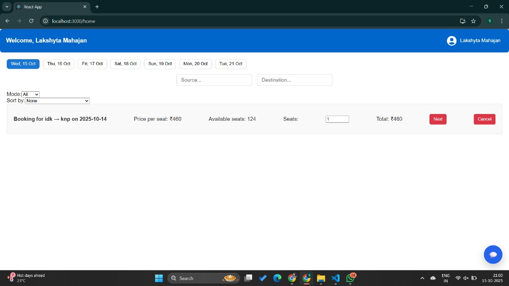
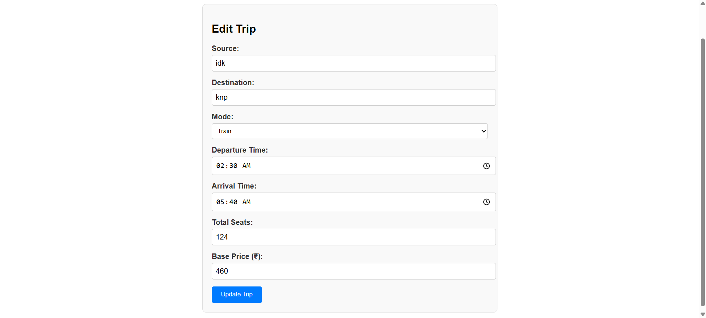

# BookYourTrip – Ticket Booking & Management System

*BookYourTrip* is an online travel ticket booking and management platform.  
It allows customers to search and book trips (with dummy payment processing), cancel or reschedule tickets (with penalties), and receive confirmations via email/SMS.  

Service providers can register, manage schedules, update details, and view analytics.  
The system also integrates *AI-based chat assistance* and *dynamic pricing suggestions* to enhance the experience.

---

## Key Features (Functional Requirements)

- *Provider Dashboard:*  
  Displays provider-specific listings, booking history, seat management, and analytics.  
  Providers can manage trips and edit their details.

- *Customer Dashboard:*  
  Shows customer bookings, upcoming trips, and provides booking or cancellation options with search/filter tools.

- *Ticket Booking & Payment:*  
  Customers can book trips between locations and pay via a dummy gateway.  
  Confirmation with booking ID is generated, and seat counts are updated automatically.

- *Booking Management:*  
  Allows users to cancel or reschedule tickets (refund/penalty applied automatically).  
  System validates policies and updates seat allocations accordingly.

- *Search & Filter:*  
  Filter available travel options by date, provider, price, or source/destination.

- *Provider Onboarding:*  
  Admins can onboard or remove service providers after verifying credentials.

- *Dynamic Pricing:*  
  Ticket prices adjust in real-time based on demand and seat availability.  
  Implemented with a simulated AI pricing engine.

- *Profile Management:*  
  Customers and providers can update their personal details and preferences.

---

## Non-Functional Requirements

- *Performance & Scalability:*  
  Supports 100+ daily users and 250+ bookings/day with average response <2s.  
  Cloud deployment and auto-scaling are used for traffic peaks.

- *Reliability & Consistency:*  
  ~99% uptime using resilient design (Saga pattern for booking/payment).  
  Prevents double-booking and ensures data consistency.

- *Security:*  
  JWT authentication, role-based access control, and encrypted sensitive data.  
  Follows OWASP security best practices.

- *Usability:*  
  Responsive React + Material UI interface with PWA compatibility.

- *Observability:*  
  Centralized logging, monitoring dashboards, and automated testing.

---

## Technology Stack

| Layer | Technology | Description |
|-------|-------------|-------------|
| *Frontend* | React, Material UI, Redux | Responsive client interface |
| *Backend* | Node.js, Express | RESTful API and routing |
| *Database* | MongoDB (Mongoose ODM) | Data persistence |
| *Authentication & Email* | JWT, Nodemailer | User verification and notifications |
| *Environment & Tools* | dotenv, bcryptjs, nodemon, Axios, React Router | Configuration and development tools |

*Architecture:*  
3-tier system — React frontend, Express backend, MongoDB database.

---

## Installation and Setup

### 1. Clone the Repository
bash
git clone <repository_url>
cd cs455-main

### 2. Backend Setup
bash
cd server
npm install

Start the backend:
bash
npm run start
# or
npm run dev

(Default port: 5000)

### 3. Frontend Setup
bash
cd client
npm install

Start the React app:
bash
npm start

Visit: [http://localhost:3000](http://localhost:3000)

---

## 🧾 User Interface Overview

### 🧍‍♀️ Customer View

#### 🪪 Signup Page

Users can create an account by entering basic details like name, email, and password. Validation ensures data accuracy before submission.

#### 🔑 Login Page

Registered users can log in securely using JWT authentication for access to their personalized dashboard.

####  Customer Dashboard

Displays upcoming trips, booking history, and quick actions like rescheduling or cancellation.  
Users can search trips or manage personal details.

####  Ticket Booking

Users can choose source and destination, select travel dates, view available trips, and proceed with booking.

####  Customer Details

Collects passenger information such as name, age, and ID type before confirming a booking.

####  Payment

A dummy payment interface allowing users to confirm and simulate payments before completing a booking.

####  Booking Successful

Displays a confirmation message with booking ID and trip details once the payment is completed successfully.

---

###  Provider View

####  Provider Dashboard

Main control panel for providers — shows analytics, total bookings, and available trips.  
Providers can edit or remove existing listings.

####  Edit Trip

Allows providers to modify trip details such as departure time, price, or available seats.

####  Add New Trip

Interface to add new travel listings by entering trip details like route, date, price, and capacity.

####  Travellers Detail

Provides the details of all the customers who booked the specific trip.
---

## Architecture Overview

The application follows a *layered 3-tier architecture*:

Client Layer       → React-based Web App (UI/UX)
Application Layer  → Node.js + Express API Gateway (Business Logic)
Data Layer          → MongoDB Database (Data Storage)

### Security
- JWT tokens and role-based access (Provider, Customer)
- Middleware for authentication and rate limiting

> Future versions can extend this monolithic design into microservices.

---

### 👨‍💻 Authors
*BookYourTrip Development Team*
Arnab Das | Kartik | Lakshyta Mahajan
*Tech Stack:* React | Node.js | Express | MongoDB | JWT | Material UI  
*Version:* 1.0.0